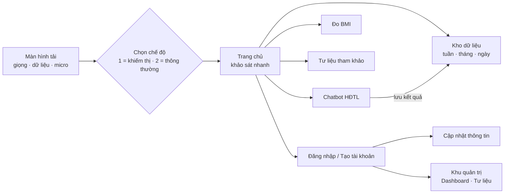

# AI HealthPulse — Nhịp Khỏe Học Đường

> Website giúp học sinh THCS/THPT **tự đánh giá mức hoạt động thể lực (HĐTL)** qua vài phút trò chuyện với AI, đo **BMI theo chuẩn WHO**, theo dõi kết quả theo **tuần / tháng** — và **dùng được hoàn toàn bằng giọng nói** cho học sinh khiếm thị hoặc khó dùng chuột, bàn phím.

Toàn bộ website là **một tệp `index.html`** (chạy trên GitHub Pages). Dữ liệu dùng chung được lưu trên **một trang Google Sheet — "Trang tính1"** — qua Google Apps Script.

---

## Mục lục bộ tài liệu

| Tài liệu | Dành cho | Nội dung |
|---|---|---|
| **README.md** (tệp này) | Mọi người | Giới thiệu, tính năng, cài đặt nhanh |
| [docs/01-HUONG-DAN-SU-DUNG.md](docs/01-HUONG-DAN-SU-DUNG.md) | Học sinh, giáo viên | Cách dùng từng trang: khảo sát, BMI, kho dữ liệu, tài khoản, quản trị |
| [docs/02-TRO-NANG.md](docs/02-TRO-NANG.md) | Học sinh khiếm thị, người hỗ trợ | Trợ lý giọng nói, lệnh nói, rê chuột, chữ nổi, ký hiệu tay, bàn phím trợ năng |
| [docs/03-DU-LIEU-GOOGLE-SHEETS.md](docs/03-DU-LIEU-GOOGLE-SHEETS.md) | Thầy cô phụ trách kỹ thuật | Cài Apps Script, cấu trúc 49 cột "Trang tính1", đồng bộ hai chiều |
| [docs/04-KY-THUAT.md](docs/04-KY-THUAT.md) | Người phát triển | Kiến trúc, các module, build, hiệu năng, kiểm thử |
| [docs/05-XU-LY-SU-CO.md](docs/05-XU-LY-SU-CO.md) | Mọi người | Câu hỏi thường gặp và cách khắc phục |

---

## Website làm được gì?

### Cho học sinh
- **Khảo sát vận động bằng Chatbot AI** — 6 câu hỏi tự nhiên (đi lại, thể thao, giờ ra chơi, việc nhà, thời gian ngồi, cuối tuần). AI hiểu câu trả lời tự do, tính **phút vận động quy đổi/tuần** theo *Cẩm nang HĐTL – Bộ Y tế (Phụ lục 2)* và xếp mức: **Không HĐTL · Không đủ (< 420 phút) · Đủ (420–600) · Cao (> 600)**, kèm một gợi ý cụ thể để thử trong tuần.
- **Mỗi ngày một lần**: đã trả lời bộ câu hỏi trong ngày thì cuộc trò chuyện mới sẽ hỏi *"Cậu cần mình giúp gì?"* thay vì hỏi lại.
- **Kho dữ liệu sức khỏe** — kết quả hằng ngày tự gom thành **tuần (đúng 7 ngày)** và **tháng (30 ngày)**: biểu đồ, bảng so sánh kỳ trước, xuất **CSV** (mở bằng Excel). Có thể hỏi Chatbot: *"thống kê tuần này"*, *"so sánh tuần trước"*, *"xuất dữ liệu"*.
- **Đo BMI** — trẻ 5–19 tuổi theo **WHO Growth Reference 2007** (z-score, kèm chiều cao theo tuổi); người ≥ 19 tuổi theo phân loại WHO và ngưỡng châu Á – Thái Bình Dương. Có **quét chiều cao bằng camera** (thử nghiệm, MediaPipe Pose).
- **Tư liệu tham khảo** do thầy cô đăng.
- **Tài khoản riêng**: lưu lịch sử trò chuyện, tự **cập nhật họ tên / khối / trường / mật khẩu** nếu sai.

### Cho giáo viên / Ban giám hiệu
- **Dashboard** chỉ hiện dữ liệu học sinh **cùng trường** (lọc theo khối, mức vận động phổ biến, khối cần ưu tiên).
- **Quản lý tư liệu tham khảo**, xem kho dữ liệu của học sinh trong trường.
- Sửa trực tiếp thông tin trên Google Sheet — website tự nhận bản mới.

### Trợ năng (điểm nổi bật)
- **Trợ lý giọng nói tiếng Việt** đọc to nội dung và nhận lệnh nói (*"trò chuyện"*, *"vùng tiếp theo"*, *"điền giúp"*…). Trang chia **vùng** có ký hiệu (V1, V2…) để di chuyển bằng giọng nói.
- **Rê chuột / phím Tab** tới đâu đọc tới đó — chuyển chỗ là **dừng ngay câu cũ** (giống trình đọc màn hình thật).
- **3 cách nhập chữ**: nói · **chữ nổi Braille 6 phím F D S J K L** · **ký hiệu tay qua camera** (máy tính) hoặc **bàn phím trợ năng** (điện thoại).
- **TTS và micro không bao giờ chạy cùng lúc**; bật điều khiển giọng nói → trợ lý nhắc *"Vui lòng chờ 8 giây…"* rồi mới mở micro.
- Nút **? Trợ giúp** (Alt + H), khung trợ lý / webcam **kéo – thu gọn được**, đọc lại nội dung vừa nhập (mật khẩu chỉ đọc số ký tự), hỗ trợ **giảm chuyển động**, focus bàn phím rõ ràng, hộp thoại có Escape và giữ Tab.

---

## Sơ đồ trang



---

## Cài đặt nhanh (5 phút)

1. **Website** — tạo kho GitHub *Public*, tải lên `index.html` và `.nojekyll` → *Settings → Pages → Deploy from a branch (main, /root)*. Web chạy tại `https://<tài-khoản>.github.io/<tên-kho>/`.
   - Mở thẳng trang khiếm thị: `…/?voice=khiemthi` · trang thường: `…/?voice=thuong`
2. **Dữ liệu dùng chung** — mở Google Sheet → *Tiện ích mở rộng → Apps Script* → dán `Code.gs` → menu **AI HealthPulse → 1. Thiết lập Trang tính1** → *Triển khai → Ứng dụng web (Thực thi: Tôi · Truy cập: Bất kỳ ai)* → dán URL `/exec` vào `SHEETS_API_URL` trong mã web. Chi tiết: [docs/03](docs/03-DU-LIEU-GOOGLE-SHEETS.md).
3. **AI trò chuyện** — mỗi tài khoản dán **API Key Gemini** một lần (nút ⚙ Cài đặt AI trong Chatbot). Không có khóa thì Chatbot vẫn chạy bằng luật dự phòng.

> Không kết nối Google Sheet thì website vẫn chạy, dữ liệu lưu trong trình duyệt (chỉ trên máy đó).

---

## Công nghệ

| Phần | Công nghệ |
|---|---|
| Giao diện | HTML · CSS · JavaScript thuần (không framework), biểu tượng Lucide (rút gọn) |
| Giọng đọc | Web Speech API (giọng Việt có sẵn) → **Piper TTS** `vi_VN-vais1000-medium` chạy trong trình duyệt (ONNX Runtime Web) → giọng trực tuyến dự phòng |
| Nhận giọng nói | Web Speech Recognition `vi-VN` + bộ lọc tạp âm (Web Audio) |
| Thị giác máy | **MediaPipe Hand Landmarker** (ký hiệu tay, điều hướng ngón tay) · **MediaPipe Pose** (quét chiều cao) |
| AI trò chuyện | Google **Gemini** (tự dò model, tự chuyển model khi lỗi) |
| Dữ liệu | Google Apps Script + Google Sheets (1 trang "Trang tính1"), dự phòng `localStorage` |
| Chuẩn y tế | Cẩm nang HĐTL Bộ Y tế · WHO Growth Reference 2007 · WHO BMI người lớn / WPRO 2000 |

---

## Cấu trúc thư mục mã nguồn

```
index.html                 khung trang (các view), màn hình tải
styles.css, *.css          giao diện
Ai-healthpulse-script.js   lõi: tài khoản, Chatbot HĐTL, Dashboard, đồng bộ Google Sheets
health-store.js            Kho dữ liệu tuần / tháng / ngày, CSV
bmi.js + who2007-data.js   đo BMI theo WHO
height-scan.js             quét chiều cao bằng camera
a11y.js                    lõi trợ năng: Device, live region, hộp thoại, khung kéo/thu gọn
voice-robot.js             trợ lý giọng nói (TTS/STT, lệnh, vùng, rê chuột, đánh vần)
vn-input.js                gõ Telex, đánh vần tiếng Việt
braille.js                 gõ chữ nổi 6 phím
finger-nav.js              camera ngón tay, ký hiệu tay, bàn phím trợ năng
piper-tts.js               giọng AI tiếng Việt chạy offline
build.py                   gộp tất cả thành 1 tệp index.html
Code.gs                    Google Apps Script (Trang tính1)
```

---

## Lưu ý

- Kết quả HĐTL và BMI **chỉ để sàng lọc, tự theo dõi**, không thay cho chẩn đoán của nhân viên y tế.
- Camera và micro **xử lý ngay trên máy**; không gửi hình ảnh hay âm thanh lên máy chủ của dự án (nhận giọng nói dùng dịch vụ của trình duyệt).
- Mật khẩu được **băm SHA-256** trước khi lưu; trợ lý không bao giờ đọc mật khẩu / khóa API ra loa.
- Trình duyệt khuyến nghị: **Chrome hoặc Edge** bản mới trên máy tính; Chrome / Safari trên điện thoại (một số tính năng giọng nói phụ thuộc trình duyệt).

---

*Dự án dự thi Cuộc thi Sáng tạo trẻ — chủ đề hoạt động thể lực học đường.*
